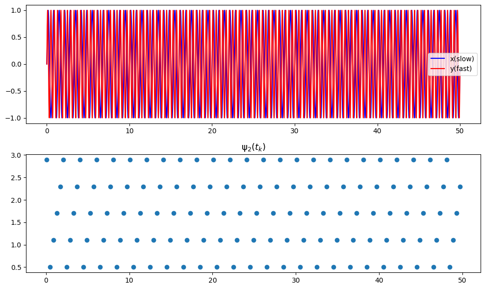
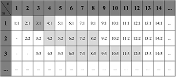
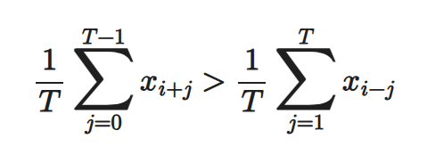

# **1.同步度计算**
## **同步图**
- 在较慢波中找出较快波峰值出现时刻的相位值，当两个信号n:m相位同步时，在对应的m归一化相对相位图中可以看到n条接近水平的线
- 同步图示例

```python
import numpy as np
import matplotlib.pyplot as plt
from scipy.signal import hilbert, find_peaks
# 参数设置
omega_x = 3
omega_y = 5
t = np.arange(0, 50, 0.01)  # 时间向量
x = np.sin(omega_x * np.pi*t)  # 较慢波（x）
y = np.sin(omega_y * np.pi*t)  # 较快波（y）

# 计算较慢波（x）的相位，使用 Hilbert 变换
phi_x = np.angle(hilbert(x))
new_phi_x = adjust_phase_to_0_mpi(phi_x)  # 调整相位到 [0, 2π] 范围内
phi_x = np.mod(new_phi_x,omega_x*2*np.pi)  # 将相位调整到 [0, 2π] 范围内
# 找到较快波（y）的峰值位置
peaks, _ = find_peaks(y)

# 在较快波的峰值位置获取较慢波的相位值
sync = phi_x[peaks]
sync_1 = new_phi_x[peaks]  # 调整后的相位值

# 绘图
fig, axes = plt.subplots(2, 1, figsize=(10, 6))

# 绘制信号图
axes[0].plot(t, x, 'b', label='x(slow)')
axes[0].plot(t, y, 'r', label='y(fast)')
axes[0].legend()

# 绘制相位同步图（Synchrogram）
axes[1].plot(peaks * 0.01, sync/(2*np.pi), 'o')  # peaks 是索引，乘以 0.01 转换为时间值
axes[1].set_title(r'$\mathrm{\psi}_2(t_k)$', fontsize=13)
plt.tight_layout()
plt.show()
```
## **同步度计算步骤**
- 参考[Cardiorespiratory Phase Synchronization in Elderly Patients with 
Periodic and non-Periodic Breathing Patterns](https://pubmed.ncbi.nlm.nih.gov/36086581/)
- 要计算某段心脏呼吸信号的同步度，首先得到呼吸信号的相位和心跳时刻
- 归一化相对相位：计算心跳时刻的呼吸相位并约束在0~2* pi* m区间，再乘以1/(2* pi)进行相位归一化
- 将n条水平线合并成一条水平线，滑窗计算，在窗口内使用类似圆方差的方法计算同步度
# **2.同步图函数工作流程**
- 使用希尔伯特变换得到呼吸相位相位，范围为-pi~pi，进行相位展开，再使用mod操作将相位约束在0~2* pi* m之间，以查看m个呼吸周期内的心跳情况
- 信号处理：对信号进行带通滤波
- 使用20s的窗口计算每个心跳时刻对应的第一个猜测的n:1并记录下来
- 使用大小为N=50的窗口计算每个点（心跳时刻）的所有可能的n:m所对应的同步度，选取其中同步度最大的作为该点的同步度，记录相应的同步比
- 确定同步度阈值，计算相应的评价指标：
- - **%Sync**： the percentage of synchronization defined as the 
sum of all the synchronization periods over the recording.
- - **AvgDurSync**: the average duration of the synchronization 
as the arithmetic mean of all periods of synchronization 
over the duration of the segment.
- - **NumSync**: the number of synchronized epochs defined as 
the sum of synchronization periods over the duration of 
the segment.
- - **FreqRat**:the frequency ratio between the respiratory and 
cardiac oscillators, as an approximation to the number of 
heartbeats per each respiration.
- 绘制同步度的变化图
- 绘制同步比的频率热图
- 绘制同步比随时间变化的折线图
## **检测所有可能的n:m**

- 参考论文[Mechanical ventilatory modes and cardioventilatory phase synchronization in acute respiratory failure patients](https://iopscience.iop.org/article/10.1088/1361-6579/aa56ae)的方法：
初步确定一个n1:1，可以使用心跳频率和呼吸频率的比值获得，如比值为3.27：1，则n:m的第一个猜测为3：1
- 在 m = 1 时，该过程将最接近猜测的两个比率（即 （n1− 1）：1 和 （n1+ 1）:1）。这两个比率称为最左和最右的比率。例如，最左侧和最右侧的比率为 m = 1 时为 2：1 和 4：1。接着 2：1 和 4：1 以 4：2 和 8：2 的形式传播到 m = 2，以 6：3 和 12：3 的形式传播到 m = 3。给定 m，则传播的比率（包括极值）都被接受为候选值。
# **3.脉搏波–呼吸耦合**
- 参考论文[Cardiorespiratory coupling in preterm infants](https://journals.physiology.org/doi/full/10.1152/japplphysiol.00722.2018)中使用的BPRSA方法：
- PRSA 是一种信号分析技术，能够检测和量化被复合信号、伪影和噪声的非平稳特性所掩盖的准周期振荡，PRSA 可以量化信号处于特定相位时每个准周期性的相干时间。相位的识别基于识别锚点 (AP)，对 AP 周围邻域的信号进行平均，即可得到原始信号的压缩相位校正版本。该 PRSA 信号包含有关产生相应 AP 的生理机制（可能是准周期机制）的信息。使用以下AP标准识别脉搏波的上升沿，将'>'换成'<'识别下降沿。
- BPRSA 是 PRSA 技术的推广，其中 AP 在一个（触发）信号中定义，而在另一个（目标）信号中进行平均，能够识别和研究从触发信号到目标信号的耦合。
- 使用脉搏波作为触发信号，呼吸波作为目标信号，查看脉搏波到呼吸信号的耦合。
## **BPRSA评价特征**

- **MRA (Maximum Respiratory Amplitude)：**  
  呼吸 BPRSA 曲线在窗口内的振幅峰峰值差，反映最大潮气量变化。

- **SAP (Slope at Anchor Point)：**  
  呼吸曲线在触发点处的瞬时斜率，正值对应吸气相，负值对应呼气相。

- **SampEn (Sample Entropy)：**  
  呼吸 BPRSA 波形的样本熵，用于量化振荡的规则性，值越小表示越规则，越大表示越随机。

