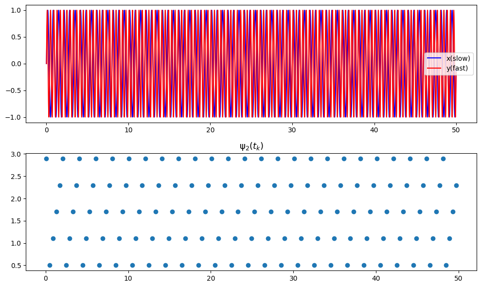
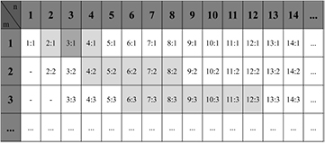
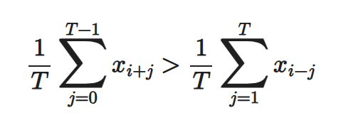

# Cardiorespiratory Coupling (CRC) Analysis at High Altitude

<!--
# 高原环境下心肺耦合（CRC）分析
-->

This repository provides the implementation, data processing scripts, and analysis tools for:

<!--
本仓库提供了官方实现、数据处理脚本和分析工具，适用于以下内容：
-->

**[Contact Sensors to Remote Cameras: Quantifying Cardiorespiratory Coupling in High-Altitude Exercise Recovery](
https://doi.org/10.48550/arXiv.2508.00773)**

<!--
《从接触式传感器到远程摄像头：高原运动恢复中的心肺耦合量化》（UbiComp '25）
-->

The codebase enables full reproduction of all main figures and tables in the paper, including CRC phase synchronization, BPRSA coupling analysis, and rPPG-based non-contact measurement.

<!--
该代码库支持完整复现论文中的所有主要图表，包括CRC相位同步、BPRSA耦合分析以及基于rPPG的非接触式测量。
-->


---

## Quick Start


1. **Required Data**: The raw data is from [SUMS](https://github.com/thuhci/SUMS). Batch processing is performed to extract relevant features and generate the data used for reproducing results. Place the processed input files in the `data/` directory (see [Repository Structure](#repository-structure) for details).
<!--
1. **所需数据**：原始数据来自 [SUMS](https://github.com/thuhci/SUMS)。通过批量处理提取相关特征并生成用于复现结果的数据。将处理后的输入文件放入 `data/` 目录（详见 [仓库结构](#repository-structure)）。
-->

2. **Reproduce Results**: Run `scripts/draw_update.ipynb` to generate all main figures and metrics for the paper.
<!--
2. **复现结果**：运行 `data/draw_update.ipynb` 以生成图表和数据。
-->


<!--
# **1.同步度计算**
## **同步图**
- 在较慢波中找出较快波峰值出现时刻的相位值，当两个信号n:m相位同步时，在对应的m归一化相对相位图中可以看到n条接近水平的线
- 同步图示例

```python
import numpy as np
import matplotlib.pyplot as plt
from scipy.signal import hilbert, find_peaks
# 参数设置
omega_x = 3
omega_y = 5
t = np.arange(0, 50, 0.01)  # 时间向量
x = np.sin(omega_x * np.pi*t)  # 较慢波（x）
y = np.sin(omega_y * np.pi*t)  # 较快波（y）

# 计算较慢波（x）的相位，使用 Hilbert 变换
phi_x = np.angle(hilbert(x))
new_phi_x = adjust_phase_to_0_mpi(phi_x)  # 调整相位到 [0, 2π] 范围内
phi_x = np.mod(new_phi_x,omega_x*2*np.pi)  # 将相位调整到 [0, 2π] 范围内
# 找到较快波（y）的峰值位置
peaks, _ = find_peaks(y)

# 在较快波的峰值位置获取较慢波的相位值
sync = phi_x[peaks]
sync_1 = new_phi_x[peaks]  # 调整后的相位值

# 绘图
fig, axes = plt.subplots(2, 1, figsize=(10, 6))

# 绘制信号图
axes[0].plot(t, x, 'b', label='x(slow)')
axes[0].plot(t, y, 'r', label='y(fast)')
axes[0].legend()

# 绘制相位同步图（Synchrogram）
axes[1].plot(peaks * 0.01, sync/(2*np.pi), 'o')  # peaks 是索引，乘以 0.01 转换为时间值
axes[1].set_title(r'$\mathrm{\psi}_2(t_k)$', fontsize=13)
plt.tight_layout()
plt.show()
```
-->
## Repository Structure

```
├── data/         # Data for reproducing results
├── scripts/      # Analysis and plotting scripts
├── figures/      # Output figures and images
├── synchrogram.py   # Synchronization Degree Calculation   
├── README.md     # Project documentation
└── BPRSA.py          # Pulse Wave–Respiration Coupling
```

# **1. Synchronization Degree Calculation**
_Corresponds to Figure 2, Figure 3, Table 1 in the paper._

## **Synchrogram**
- Find the phase values of the slower wave at the time points where the faster wave peaks occur. When two signals are n:m phase synchronized, you will see n nearly horizontal lines in the m-normalized relative phase plot.
- Example of a synchrogram:

```python
import numpy as np
import matplotlib.pyplot as plt
from scipy.signal import hilbert, find_peaks
# Parameter settings
omega_x = 3
omega_y = 5
t = np.arange(0, 50, 0.01)  # Time vector
x = np.sin(omega_x * np.pi * t)  # Slower wave (x)
y = np.sin(omega_y * np.pi * t)  # Faster wave (y)

# Calculate the phase of the slower wave (x) using Hilbert transform
phi_x = np.angle(hilbert(x))
new_phi_x = adjust_phase_to_0_mpi(phi_x)  # Adjust phase to [0, 2π] range
phi_x = np.mod(new_phi_x, omega_x * 2 * np.pi)  # Adjust phase to [0, 2π] range
# Find the peak positions of the faster wave (y)
peaks, _ = find_peaks(y)

# Get the phase values of the slower wave at the peaks of the faster wave
sync = phi_x[peaks]
sync_1 = new_phi_x[peaks]  # Adjusted phase values

# Plotting
fig, axes = plt.subplots(2, 1, figsize=(10, 6))

# Plot the signals
axes[0].plot(t, x, 'b', label='x (slow)')
axes[0].plot(t, y, 'r', label='y (fast)')
axes[0].legend()

# Plot the phase synchrogram
axes[1].plot(peaks * 0.01, sync / (2 * np.pi), 'o')  # peaks are indices, multiply by 0.01 to convert to time
axes[1].set_title(r'$\mathrm{\psi}_2(t_k)$', fontsize=13)
plt.tight_layout()
plt.show()
```
<!--## **同步度计算步骤**
- 参考[Cardiorespiratory Phase Synchronization in Elderly Patients with 
Periodic and non-Periodic Breathing Patterns](https://pubmed.ncbi.nlm.nih.gov/36086581/)
- 要计算某段心脏呼吸信号的同步度，首先得到呼吸信号的相位和心跳时刻
- 归一化相对相位：计算心跳时刻的呼吸相位并约束在0~2* pi* m区间，再乘以1/(2* pi)进行相位归一化
- 将n条水平线合并成一条水平线，滑窗计算，在窗口内使用类似圆方差的方法计算同步度-->
## **Synchronization Degree Calculation Steps**
- Refer to [Cardiorespiratory Phase Synchronization in Elderly Patients with Periodic and non-Periodic Breathing Patterns](https://pubmed.ncbi.nlm.nih.gov/36086581/)
- To calculate the synchronization degree of a segment of cardiac and respiratory signals, first obtain the phase of the respiratory signal and the timing of heartbeats.
- Normalize the relative phase: calculate the respiratory phase at heartbeat times, constrain it to the 0~2πm interval, and then normalize by multiplying by 1/(2π).
- Merge the n horizontal lines into a single line, use a sliding window, and calculate the synchronization degree within the window using a method similar to circular variance.
  
 <!--# **2.同步图函数工作流程**
- 使用希尔伯特变换得到呼吸相位相位，范围为-pi~pi，进行相位展开，再使用mod操作将相位约束在0~2* pi* m之间，以查看m个呼吸周期内的心跳情况
- 信号处理：对信号进行带通滤波
- 使用20s的窗口计算每个心跳时刻对应的第一个猜测的n:1并记录下来
- 使用大小为N=50的窗口计算每个点（心跳时刻）的所有可能的n:m所对应的同步度，选取其中同步度最大的作为该点的同步度，记录相应的同步比
- 确定同步度阈值，计算相应的评价指标：--> 

# **2. Synchrogram Function Workflow**
- Use the Hilbert transform to obtain the respiratory phase (range: -π to π), perform phase unwrapping, and then use the mod operation to constrain the phase within [0, 2πm] to observe heartbeats within m respiratory cycles.
- Signal processing: apply bandpass filtering to the signals.
- Use a 20-second window to calculate and record the initial guess of n:1 for each heartbeat.
- For each point (heartbeat time), use a window of size N=50 to calculate the synchronization degree for all possible n:m ratios, select the maximum synchronization degree as the value for that point, and record the corresponding synchronization ratio.
- Determine the synchronization threshold and calculate the relevant evaluation metrics:
- **%Sync**: the percentage of synchronization defined as the sum of all the synchronization periods over the recording.  
  <!-- **%Sync**：同步百分比，定义为整个记录期间所有同步时段的总和占比。 -->

- **AvgDurSync**: the average duration of the synchronization as the arithmetic mean of all periods of synchronization over the duration of the segment.  
  <!-- **AvgDurSync**：同步平均持续时间，定义为该片段内所有同步时段的算术平均值。 -->

- **NumSync**: the number of synchronized epochs defined as the sum of synchronization periods over the duration of the segment.  
  <!-- **NumSync**：同步段数，定义为该片段内所有同步时段的数量。 -->

- **FreqRat**: the frequency ratio between the respiratory and cardiac oscillators, as an approximation to the number of heartbeats per each respiration.  
  <!-- **FreqRat**：呼吸与心脏振荡器的频率比，近似为每次呼吸对应的心跳数。 -->


<!--## **检测所有可能的n:m**

- 参考论文[Mechanical ventilatory modes and cardioventilatory phase synchronization in acute respiratory failure patients](https://iopscience.iop.org/article/10.1088/1361-6579/aa56ae)的方法：
初步确定一个n1:1，可以使用心跳频率和呼吸频率的比值获得，如比值为3.27：1，则n:m的第一个猜测为3：1
- 在 m = 1 时，该过程将最接近猜测的两个比率（即 （n1− 1）：1 和 （n1+ 1）:1）。这两个比率称为最左和最右的比率。例如，最左侧和最右侧的比率为 m = 1 时为 2：1 和 4：1。接着 2：1 和 4：1 以 4：2 和 8：2 的形式传播到 m = 2，以 6：3 和 12：3 的形式传播到 m = 3。给定 m，则传播的比率（包括极值）都被接受为候选值。-->

## **检测所有可能的n:m**

- Refer to the method from the paper [Mechanical ventilatory modes and cardioventilatory phase synchronization in acute respiratory failure patients](https://iopscience.iop.org/article/10.1088/1361-6579/aa56ae):
First, determine an initial n1:1 ratio, which can be obtained by the ratio of heart rate to respiratory rate. For example, if the ratio is 3.27:1, the first guess for n:m is 3:1.
- When m = 1, the process selects the two ratios closest to the initial guess, i.e., (n1−1):1 and (n1+1):1. These are called the leftmost and rightmost ratios. For example, when m = 1, the leftmost and rightmost ratios are 2:1 and 4:1. Then, 2:1 and 4:1 propagate to m = 2 as 4:2 and 8:2, and to m = 3 as 6:3 and 12:3. For a given m, all propagated ratios (including the extremes) are accepted as candidate values.


<!--# **3.脉搏波–呼吸耦合**
- 参考论文[Cardiorespiratory coupling in preterm infants](https://journals.physiology.org/doi/full/10.1152/japplphysiol.00722.2018)中使用的BPRSA方法：
- PRSA 是一种信号分析技术，能够检测和量化被复合信号、伪影和噪声的非平稳特性所掩盖的准周期振荡，PRSA 可以量化信号处于特定相位时每个准周期性的相干时间。相位的识别基于识别锚点 (AP)，对 AP 周围邻域的信号进行平均，即可得到原始信号的压缩相位校正版本。该 PRSA 信号包含有关产生相应 AP 的生理机制（可能是准周期机制）的信息。使用以下AP标准识别脉搏波的上升沿，将'>'换成'<'识别下降沿。

- BPRSA 是 PRSA 技术的推广，其中 AP 在一个（触发）信号中定义，而在另一个（目标）信号中进行平均，能够识别和研究从触发信号到目标信号的耦合。
- 使用脉搏波作为触发信号，呼吸波作为目标信号，查看脉搏波到呼吸信号的耦合。
## **BPRSA评价特征**

- **MRA (Maximum Respiratory Amplitude)：**  
  呼吸 BPRSA 曲线在窗口内的振幅峰峰值差，反映最大潮气量变化。

- **SAP (Slope at Anchor Point)：**  
  呼吸曲线在触发点处的瞬时斜率，正值对应吸气相，负值对应呼气相。
-->

# **3. Pulse Wave–Respiration Coupling**
_Corresponds to Figure 4, Table 2 in the paper._
- Refer to the BPRSA method used in the paper [Cardiorespiratory coupling in preterm infants](https://journals.physiology.org/doi/full/10.1152/japplphysiol.00722.2018):
- PRSA (Phase-Rectified Signal Averaging) is a signal analysis technique that can detect and quantify quasi-periodic oscillations masked by non-stationary characteristics, artifacts, and noise in composite signals. PRSA quantifies the coherent time of each quasi-periodicity when the signal is at a specific phase. Phase identification is based on detecting anchor points (AP), and averaging the signal around these APs yields a compressed, phase-aligned version of the original signal. This PRSA signal contains information about the physiological mechanisms (possibly quasi-periodic) that generate the corresponding APs. The following AP criteria are used to identify the rising edge of the pulse wave; replacing '>' with '<' identifies the falling edge.

- BPRSA (Bivariate PRSA) is an extension of the PRSA technique, where APs are defined in one (trigger) signal and averaging is performed in another (target) signal, enabling the identification and study of coupling from the trigger to the target signal.
- In this context, the pulse wave is used as the trigger signal and the respiratory wave as the target signal to examine the coupling from pulse wave to respiration.

## **BPRSA Evaluation Features**

- **MRA (Maximum Respiratory Amplitude):**  
  The peak-to-peak amplitude difference of the respiratory BPRSA curve within the window, reflecting the maximum tidal volume change.

- **SAP (Slope at Anchor Point):**  
  The instantaneous slope of the respiratory curve at the anchor point; a positive value corresponds to inspiration, and a negative value corresponds to expiration.


